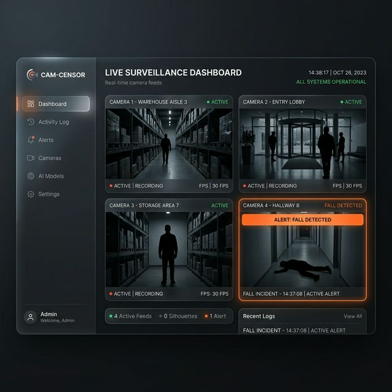
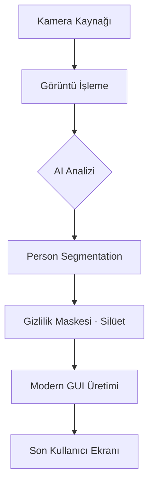

# 🛡️ Cam-Censor: Akıllı Gizlilik Koruması Platformu

Cam-Censor, yapay zeka (YOLOv8) destekli, bireysel gizliliği en üst düzeyde korumak için tasarlanmış profesyonel bir yazılım çözümüdür.



## 🚀 Proje Vizyonu
Geleneksel güvenlik sistemleri, izlenen kişilerin kimliklerini ve mahremiyetlerini koruyamaz. Cam-Censor, **"Gizli Koruma"** felsefesiyle, insanları görüntüden tamamen silerek sadece ortam güvenliğine ve hareket dinamiğine odaklanır.

---

## ✨ Öne Çıkan Özellikler

### 👥 Gelişmiş Gizlilik Maskeleme
Standart kutu (bbox) yöntemi yerine, **YOLOv8-Segmentation** kullanarak insan vücudunu piksel hassasiyetinde siyah silüetlerle kapatır. Identity (kimlik) bilgisi görüntüden tamamen arındırılır.

### 🎥 Gözetim Modu (Multi-Camera)
Aynı anda birden fazla kamerayı dinamik bir ızgara düzeninde izleyebilir. Her kamera bağımsız bir AI motoruyla denetlenir ve merkezi bir panelden yönetilir.

### 🛠️ Simülasyon Sistemi
Tek bir kameranız olsa bile çoklu kamera senaryolarını test edebilmeniz için yerleşik simülasyon moduna sahiptir.

---

## 🛠️ Teknik Mimari



---

## 💻 Kurulum ve Kullanım

### Gereksinimler
- Python 3.9 veya üzeri
- OpenCV, CustomTkinter, Ultralytics (YOLOv8)

### Adımlar
1. Depoyu klonlayın ve bağımlılıkları yükleyin:
   ```bash
   pip install -r requirements.txt
   ```
2. Uygulamayı başlatın:
   ```bash
   python app_gui.py
   ```

### Windows için Paketleme (.exe)
Uygulamayı bağımsız bir .exe dosyasına dönüştürmek için:
```bash
python package_pyinstaller.py
```

---

## 🌟 Portfolyo Bilgisi
Bu proje, modern Python teknolojileri, gerçek zamanlı AI inferencing (çıkarım) ve kullanıcı dostu arayüz tasarım prensipleri birleştirilerek geliştirilmiştir. Güvenlik ve gizlilik dengesini sağlamak için tasarlanan bu çözüm, hastaneler, özel yaşam alanları ve kamuya açık alanlar için idealdir.

---
*Geliştirici: [İsim/Github Linkiniz]*
